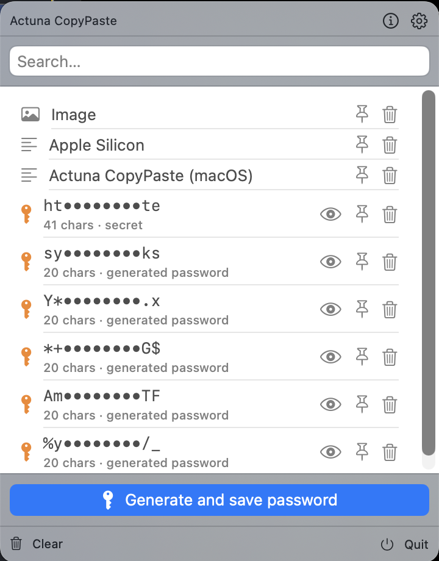

# Actuna CopyPaste (macOS)

[](LICENSE)
-lightgrey)


A native macOS clipboard manager for Apple Silicon: a cursor-anchored history popup
(summoned by a global hotkey or a mouse gesture) that pastes the right item into the
focused app — Finder, browsers, editors, and terminals. It treats sensitive data
(passwords, API keys, card numbers) as **secrets**: encrypted at rest, masked in the
UI, revealed only behind Touch ID — and includes a **password generator** whose output
lands straight in the secure clipboard.

<p align="center">
  
</p>

> macOS does not let third-party apps inject items into other apps' native right-click
> menus. The native equivalent of "under the right mouse button" is a floating panel
> summoned by a hotkey and/or a modifier+right-click gesture (the Maccy/Paste/Raycast
> pattern).

## Features

- **Summon at the cursor** — global hotkey **⌘⇧V** (Carbon `RegisterEventHotKey`, no TCC
  prompt, works sandboxed), or **⌃ + right-click** anywhere (full build; active `CGEventTap`).
- **Click to paste** — selecting an item pastes it into the previously-focused app via a
  synthetic ⌘V. Without the Accessibility/PostEvent grant it degrades to "copy — press ⌘V".
- **One combined list** — clipboard history and saved secrets live together; secrets show
  only a masked preview (`ab••••yz`) and are revealed or pasted only behind **Touch ID**.
- **Password generator** — all options (length, character classes, passphrase mode…) live
  behind the **⚙️** in a separate, remembered-between-launches settings window; the panel
  keeps a single **"Generuj i zapisz"** button that generates per your settings and drops
  the password straight into the secure clipboard.
- **Auto-clear** — the system pasteboard is wiped N seconds after a secret is written
  (only if nothing newer was copied).
- **Permissions, up front** — auto-paste (and the gesture) need Accessibility; the app
  checks at launch and prompts once if it is missing.
- **Localized** — UI in English, Polish, German and Spanish, picked automatically from
  the system language. The ⓘ in the panel header opens the standard macOS About panel
  (name, version, GPLv3); the ⚙️ opens the generator settings.

## Principles

- **Native-first (Apple Silicon).** First-party Apple frameworks only — no third-party
  dependencies where an Apple framework exists: SwiftData, CryptoKit + Secure Enclave,
  LocalAuthentication, Security (`SecRandomCopyBytes`), AppKit/SwiftUI, CoreGraphics,
  Carbon/HIToolbox.
- **DDD + hexagonal.** A pure-Swift domain core (no AppKit/IO) behind ports; platform
  behavior lives in adapters. The two distribution builds are two adapter sets / capability
  sets, not one flag.
- **TDD.** Logic is driven test-first; the domain and the testable adapters run as fast
  unit tests (Swift Testing).

## Architecture

```text
ActunaCopyPasteCore      (pure Swift — domain + application + ports)
  Domain/        ClipboardHistory, ClipItem, Secret, MaskedPreview,
                 SensitivityClassifier, PasswordGenerator, ContentHashing
  Application/   CaptureClipUseCase, ClipboardEngine (the orchestrating actor)
  Ports/         SecretsVaultPort, HistoryStorePort, PasteboardMonitorPort,
                 PastePort, ClipboardWriterPort, TriggerPort, FocusedFieldPort,
                 RandomnessPort, ContentHashing, CapabilitySet …

ActunaCopyPastePlatform  (native Apple-framework adapters)
  Crypto/        EnvelopeVault, SecureEnclaveKeyAgreement (+ software fallback),
                 LABiometricGate, KeychainKeyStore, VaultKeyProvisioner
  Store/         SwiftDataHistoryStore (@Model ClipRecord) + ciphertext store
  Pasteboard/    NSPasteboardMonitor, NSPasteboardClipboardWriter, SystemPaster
  SecureRandomness (SecRandomCopyBytes), CryptoKitHashing (SHA-256)

ActunaCopyPasteUI        (AppKit/SwiftUI menu-bar agent — shared by both app targets)
  AppController, MenuBarController, HistoryPanel(+Controller), PanelRootView,
  CarbonHotKeyTrigger, GestureTrigger, PermissionPolicy,
  GeneratorPreferences/SettingsModel + SettingsWindowController, CompositionBuilder
```

## Security model

- **Classification** — honors nspasteboard.org markers (`ConcealedType`, `TransientType`,
  `AutoGeneratedType`) first, then content heuristics (private-key blocks, JWTs, provider
  key prefixes, Luhn card numbers, high Shannon entropy).
- **Envelope encryption** — each secret's payload is sealed with a per-record AES-256-GCM
  data key (CryptoKit); the data key is ECDH-wrapped to a **Secure Enclave** P-256 key
  (software fallback when the Enclave is unavailable). No plaintext and no unwrapped key is
  ever stored. The KEK lives in the data-protection Keychain.
- **Masked preview** — history shows only `ab••••yz` plus context; plaintext is rendered
  only after a successful Touch ID reveal.
- **Paste without reveal** — a secret pastes into a detected secure (password) field with no
  prompt; any other target degrades to Touch ID. Secret plaintext never leaves the engine
  boundary — it goes straight to the paste port.
- **Auto-clear** — the pasteboard is wiped N seconds after a secret is written (only if
  nothing newer was copied).

## Build, test & run

Requirements: **macOS 14+ (Apple Silicon)**, **Swift 6** toolchain (Xcode 26+).

```sh
swift build
swift test            # 136 tests (domain, crypto, store, pasteboard, UI logic)
```

Build and run the menu-bar app:

```sh
# one-time: a stable local code-signing identity so macOS PERSISTS the Accessibility
# grant across launches/rebuilds (ad-hoc signing forces re-granting every launch)
Scripts/make-signing-cert.sh

Scripts/build-app.sh               # → build/full/ActunaCopyPaste.app
open "build/full/ActunaCopyPaste.app"
```

On first run, grant **System Settings → Privacy & Security → Accessibility** so auto-paste
and the ⌃+right-click gesture work. The domain and the testable adapters run headlessly;
system adapters that require permissions or a focused app (CGEvent paste, global
hotkey/gesture) are verified in the app target / manually.

## Distribution

A single **Developer-ID, non-sandboxed** build (`App-Full`): mouse-gesture trigger
(`CGEventTap`), secure-field detection (Accessibility), and auto-paste. It runs as a
menu-bar agent (`NSApplicationActivationPolicy.accessory`, `LSUIElement`) — never a launchd
daemon, because the Secure Enclave and the data-protection keychain are unavailable to
daemons.

## License

Licensed under the **GNU General Public License v3.0** — see [LICENSE](LICENSE).

Copyright © Actuna (Wojciech Repiński).
